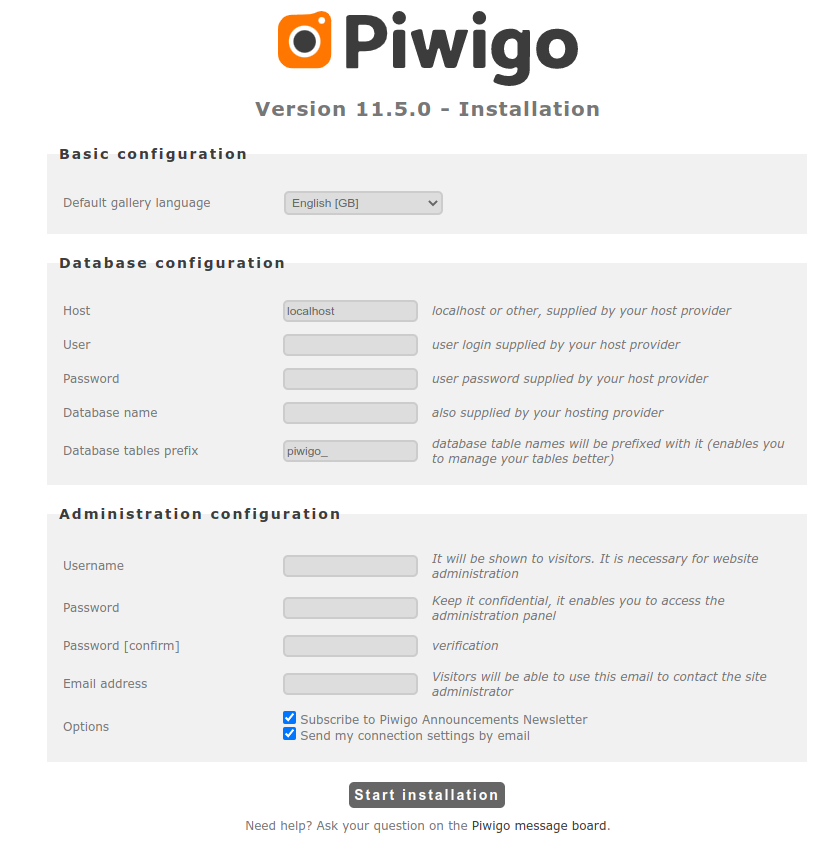

# Docker Piwigo + mysql/mariadb

Basierend auf dem Piwigo Docker Container von [LinuxServer.io](https://www.linuxserver.io/) und dem [MariaDB Docker Container](https://hub.docker.com/_/mariadb/) von [MariaDB](https://mariadb.com/)
findet sich hier die `docker-compose.yml`-Implementierung um Piwigo zusammen mit MariaDB zum Laufen zu bringen.

# Quickstart

* Einfach eine `piwigo-db.env` Datei mit folgenden Variablen erstellen:

```
MARIADB_ROOT_PASSWORD=...
MARIADB_DATABASE=...
MARIADB_USER=...
MARIADB_PASSWORD=...
```

Anmerkung: Per MARIADB_USER wird auf die MARIADB_DATABASE zugegriffen. Es macht also Sinn, `MARIADB_USER` + `MARIADB_DATABASE` gleich zu benennen und
das Schema "$PREFIX_$GALLERYNAME" zu verwenden (zB. `piwigo_mygallery`).

* Docker Container per `docker-compose` starten:

```
  ❯ docker-compose up -d
```

* Piwigo aufrufen und einrichten:

Die Piwigo Installation wird unter http://localhost:8081 aufgerufen und man kann Piwigo sofort konfigurieren:



# Backup

## Datenbank

* Backup der Datenbank erstellen

```
  ❯ mkdir ../backup
  ❯ docker exec -it db sh -c 'mysqldump piwigo_mygallery -p$MARIADB_ROOT_PASSWORD' > ../backup/piwigo.mysqldump-$(date +%Y%m%d-%H%m%S)

oder:

  ❯ export $(grep MARIADB_USER piwigo-db.env); docker exec -it db sh -c "mysqldump $MARIADB_USER -p\$MARIADB_ROOT_PASSWORD" > ../backup/piwigo.mysqldump-$(date +%Y%m%d-%H%m%S)
```

## Konfiguration + Gallery

* `gallery/local/config`
* `gallery/_data`
* `gallery/themes`

```
  ❯ tar -czf ../backup/piwig-config.tgz gallery/local/config
  ❯ tar -czf ../backup/piwigo-data.tgz gallery/_data
  ❯ tar -czf ../backup/piwigo-themes.tgz gallery/themes
```

# Restore

## Datenbank

* Restore: Backup der Datenbank einspielen

```
  ❯ docker exec -i piwigo-db sh -c 'mysql -u root piwigo_mygallery -p$MARIADB_ROOT_PASSWORD' < ../backup/piwigo.mysqldump-20210721-210753

oder:

  ❯ export $(grep MARIADB_DATABASE piwigo-db.env); docker exec -i piwigo-db sh -c "mysql -u root $MARIADB_DATABASE -p\$MARIADB_ROOT_PASSWORD" < ../backup/piwigo.mysqldump-20210721-210753
```

Anmerkung: Da die Umgebungsvariable `MARIADB_ROOT_PASSWORD` im MariaDB Docker Container gesetzt wird, ist der Variablename in einfachen Anführungszeichen zu setzen oder man muss das `$` mit `\` escapen.
`piwigo_mygallery` ist der (wirkliche) Name der Piwigo-Datenbank (also der Inhalt von `MARIADB_DATABASE=`).

## Konfiguration + Gallery

* `gallery/local/config`
* `gallery/_data`
* `gallery/themes`

## Was ist Piwigo?

Piwigo ist eine Open-Source Fotogallerie für das Web.

## Was ist MariaDB?

The open source relational database.

## Was ist LinuxServer.io?


